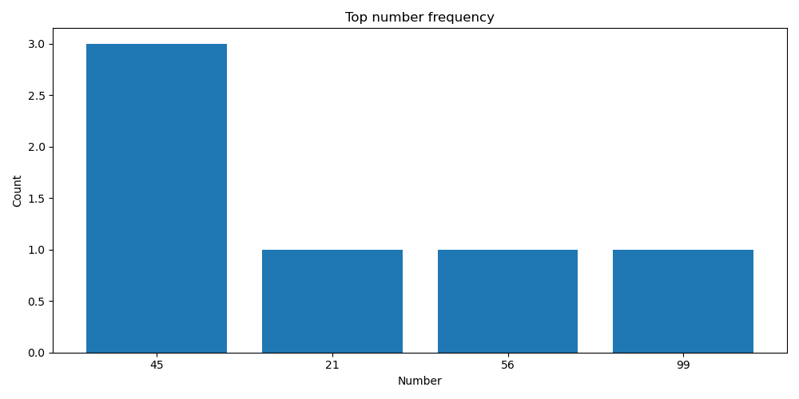
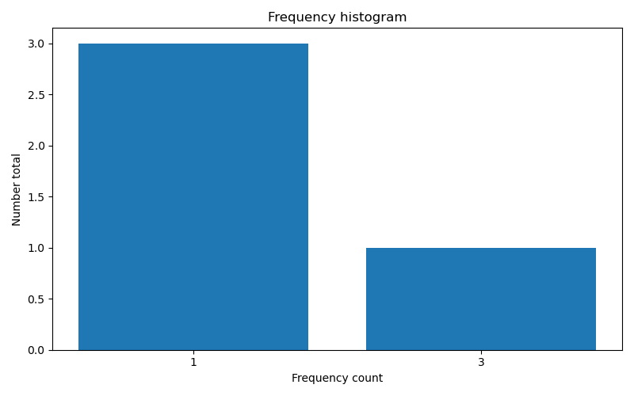

# Xổ số miền Bắc — Dashboard phân tích

   

Dự án thu thập, chuẩn hóa, lưu trữ, phân tích và trực quan hóa dữ liệu kết quả xổ số miền Bắc từ nguồn công khai. Toàn bộ pipeline được thiết kế để chạy tự động bằng GitHub Actions, xuất báo cáo Markdown và dashboard HTML tĩnh qua GitHub Pages.

> Dự án chỉ phục vụ mục đích học tập, phân tích dữ liệu và minh họa kỹ thuật. Không cung cấp dự đoán, lời khuyên cá cược hoặc khuyến nghị đánh số.

## Trạng thái hiện tại

| Hạng mục | Đường dẫn |
|---|---|
| Dashboard HTML | [`docs/index.html`](docs/index.html) |
| Báo cáo Markdown | [`docs/report.md`](docs/report.md) |
| Biểu đồ tĩnh | [`docs/assets/`](docs/assets/) |
| Dữ liệu đã xử lý | [`data/processed/`](data/processed/) |
| Kết quả phân tích | [`data/reports/`](data/reports/) |
| Workflow hằng ngày | [`.github/workflows/daily-update.yml`](.github/workflows/daily-update.yml) |

Sau khi workflow hằng ngày chạy với nguồn dữ liệu thật, các file trong `data/` và `docs/` sẽ được cập nhật tự động và được commit lại vào repository nếu có thay đổi.

## Dashboard trực tiếp trong README

> Phần này đang hiển thị bản xem trước từ dữ liệu mẫu có trong repository. Khi workflow hằng ngày chạy với nguồn dữ liệu thật, các bảng và hình ảnh có thể được cập nhật tự động từ `data/` và `docs/`.

### Tóm tắt dữ liệu mẫu

| Chỉ số | Giá trị |
|---|---:|
| Số kỳ mẫu | 3 |
| Khoảng ngày mẫu | 2026-07-10 → 2026-07-12 |
| Số bản ghi giải thưởng | 6 |
| Số hai chữ số cuối khác nhau | 4 |
| Số xuất hiện nhiều nhất | `45` |

### Top tần suất hai chữ số cuối

| Hạng | Số | Số lần |
|---:|---:|---:|
| 1 | `45` | 3 |
| 2 | `21` | 1 |
| 3 | `56` | 1 |
| 4 | `99` | 1 |

### Gan số trong dữ liệu mẫu

| Số | Lần xuất hiện gần nhất | Số ngày chưa xuất hiện |
|---:|---|---:|
| `56` | 2026-07-10 | 2 |
| `45` | 2026-07-12 | 0 |

### Biểu đồ nhanh

| Tần suất | Histogram |
|---|---|
|  |  |

<details>
<summary><strong>Xem bảng dữ liệu phân tích mẫu</strong></summary>

#### `frequency.csv`

| number | count |
|---:|---:|
| 45 | 3 |
| 21 | 1 |
| 56 | 1 |
| 99 | 1 |

#### `days_since_last_seen.csv`

| number | last_seen | days_since |
|---:|---|---:|
| 45 | 2026-07-12 | 0 |
| 56 | 2026-07-10 | 2 |

</details>

## Tính năng chính

- Thu thập kết quả xổ số miền Bắc theo ngày hoặc khoảng ngày.
- Cache nội dung tải về để giảm số lần gọi nguồn công khai.
- Retry khi request lỗi tạm thời.
- Parse HTML và chuẩn hóa dữ liệu giải thưởng.
- Lưu dữ liệu lịch sử dạng CSV dễ review và dễ commit.
- Cập nhật incremental, tránh ghi trùng ngày đã có.
- Phân tích tần suất, tần suất rolling, số ngày chưa xuất hiện, phân bố theo tháng, heatmap, histogram và moving average.
- Sinh dashboard HTML tĩnh, chart PNG và báo cáo Markdown.
- Tự động chạy bằng GitHub Actions và publish qua GitHub Pages.

## Cấu trúc dữ liệu

| Nhóm | File | Mô tả |
|---|---|---|
| Kết quả ngày | `data/processed/draws.csv` | Mỗi dòng là một kỳ quay đã chuẩn hóa. |
| Chi tiết giải | `data/processed/prizes.csv` | Mỗi dòng là một giải trong một kỳ quay. |
| Tần suất | `data/reports/frequency.csv` | Đếm tần suất theo hai chữ số cuối. |
| Rolling | `data/reports/rolling_frequency.csv` | Tần suất theo cửa sổ trượt. |
| Gan số | `data/reports/days_since_last_seen.csv` | Số ngày kể từ lần xuất hiện gần nhất. |
| Theo tháng | `data/reports/monthly_distribution.csv` | Phân bố theo tháng và số. |
| Heatmap | `data/reports/heatmap.csv` | Ma trận phục vụ bản đồ nhiệt. |
| Histogram | `data/reports/histogram.csv` | Phân bố các mức tần suất. |
| Moving average | `data/reports/moving_average.csv` | Trung bình trượt theo cửa sổ cấu hình. |

Chi tiết schema xem tại [`docs/data-schema.md`](docs/data-schema.md).

## Cài đặt local

Yêu cầu Python 3.12 trở lên.

```powershell
python -m pip install -e ".[dev]"
```

Nếu máy có nhiều bản Python, có thể dùng launcher:

```powershell
py -3.13 -m pip install -e ".[dev]"
```

## Cấu hình

Sao chép file cấu hình mẫu:

```powershell
Copy-Item .env.example .env
```

Các biến quan trọng:

| Biến | Ý nghĩa |
|---|---|
| `VN_LOTTERY_SOURCE_NAME` | Tên nguồn dữ liệu. |
| `VN_LOTTERY_BASE_URL` | URL nguồn, cần có placeholder `{date}`. |
| `VN_LOTTERY_DATA_DIR` | Thư mục dữ liệu. |
| `VN_LOTTERY_CACHE_DIR` | Thư mục cache. |
| `VN_LOTTERY_REPORT_DIR` | Thư mục kết quả phân tích. |
| `VN_LOTTERY_DOCS_DIR` | Thư mục dashboard và báo cáo để publish. |
| `VN_LOTTERY_REQUEST_TIMEOUT_SECONDS` | Timeout khi tải dữ liệu. |
| `VN_LOTTERY_RETRY_ATTEMPTS` | Số lần retry. |
| `VN_LOTTERY_ROLLING_WINDOW_DAYS` | Kích thước cửa sổ rolling mặc định. |

> `.env.example` đang dùng URL mẫu. Khi chạy thật cần thay `VN_LOTTERY_BASE_URL` bằng nguồn công khai phù hợp và chỉnh parser nếu HTML của nguồn khác fixture.

## Cách dùng

Thu thập một ngày:

```powershell
vn-lottery collect --date 2026-07-13
```

Thu thập một khoảng ngày:

```powershell
vn-lottery collect --start-date 2026-07-01 --end-date 2026-07-13
```

Chạy thử nhưng không ghi dữ liệu:

```powershell
vn-lottery collect --start-date 2026-07-01 --end-date 2026-07-13 --dry-run
```

Cập nhật incremental:

```powershell
vn-lottery update --from 2026-07-13 --to 2026-07-13
```

Sinh các bảng phân tích:

```powershell
vn-lottery analyze --start-date 2026-07-01 --end-date 2026-07-31 --window 30
```

Sinh báo cáo Markdown:

```powershell
vn-lottery report --output docs/report.md
```

Sinh dashboard và biểu đồ:

```powershell
vn-lottery visualize --output-dir docs
```

Chạy toàn bộ pipeline hằng ngày:

```powershell
vn-lottery run-daily
```

## Kiểm thử và chất lượng

```powershell
python -m pytest
python -m ruff check src tests
python -m mypy src/vn_lottery_xsmb
```

Kiểm thử có coverage:

```powershell
python -m pytest --cov=vn_lottery_xsmb tests
```

Kết quả validation gần nhất được ghi trong [`docs/validation.md`](docs/validation.md).

## GitHub Actions và GitHub Pages

Repository có hai workflow:

| Workflow | Mục đích |
|---|---|
| [`ci.yml`](.github/workflows/ci.yml) | Chạy lint, type-check và test khi push hoặc pull request. |
| [`daily-update.yml`](.github/workflows/daily-update.yml) | Chạy pipeline hằng ngày, commit dữ liệu/báo cáo mới và deploy GitHub Pages. |

Để bật Pages:

1. Vào `Settings` → `Pages`.
2. Chọn nguồn deploy là `GitHub Actions`.
3. Vào `Settings` → `Actions` → `General`.
4. Bật `Read and write permissions` cho workflow.

URL Pages thường có dạng:

```text
https://<github-user>.github.io/vn-lottery-xsmb/
```

## Tài liệu

- [`docs/data-schema.md`](docs/data-schema.md): schema dữ liệu.
- [`docs/maintenance.md`](docs/maintenance.md): hướng dẫn bảo trì khi nguồn thay đổi.
- [`docs/commit-plan.md`](docs/commit-plan.md): kế hoạch commit theo milestone.
- [`docs/validation.md`](docs/validation.md): ghi chú kiểm thử và validation.

## Chính sách mã nguồn tự viết

Toàn bộ mã nguồn, kiểm thử, dữ liệu mẫu, tài liệu, tên hàm, tên lớp, chú thích và workflow trong repository này được viết mới cho dự án. Có thể tham khảo ý tưởng ở mức khái niệm từ các dự án công khai, nhưng không sao chép, dịch lại hoặc chuyển thể chi tiết triển khai.

## Giấy phép

Dự án sử dụng giấy phép MIT.
